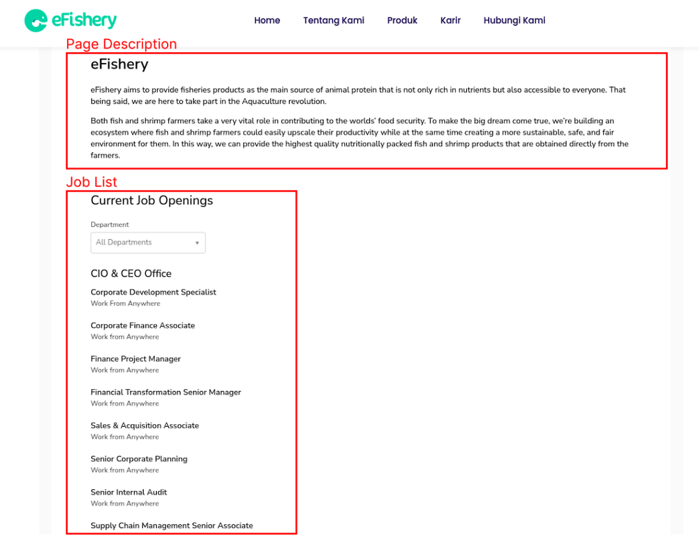
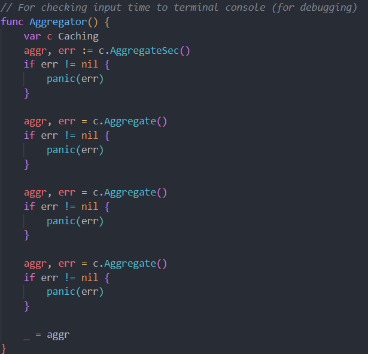

# Soal Pertama

Petani memiliki uang 100.000 lalu barang yang ada di point eFishery sebagai berikut ini
| ID | Barang | Harga |
| --- | --- | --- |
| 1 | Benih Lele | 50.000 |
| 2 | Pakan Lele cap menara | 25.000 |
| 3 | Probiotik A | 75.000 |
| 4 | Probiotik Nila B | 10.000 |
| 5 | Pakan Nila | 20.000 |
| 6 | Benih Nila | 20.000 |
| 7 | Cupang | 5.000 |
| 8 | Benih Nila | 30.000 |
| 9 | Benih Cupang | 10.000 |
| 10 | Probiotik B | 10.000 |

- Dengan data berikut ini buatlah sebuah algoritma agar petani dapat membeli barang paling banyak dengan jumlah uang 100.000. Petani hanya boleh membeli 1 item di masing-masing barang.
- Buat function untuk mencari barang paling murah dan barang paling mahal. Tidak boleh menggunakan function sort
- Buatlah function untuk menampilkan barang dengan harga 10.000

## Example Output

Total produk dengan harga dibawah Rp 100.000 :</br>
Harga total 100000</br>
Cupang - 5000</br>
Probiotik Nila B - 10000 </br>
Benih Cupang - 10000</br>
Probiotik B - 10000</br>
Benih Nila 1 - 20000</br>
Pakan Nila - 20000</br>
Pakan lele cap menara - 25000</br>
</br>
Daftar produk dengan harga Rp 10.000 : </br>
Probiotik Nila B - 10000</br>
Benih Cupang - 10000</br>
Probiotik B - 10000</br>
<br>

Daftar produk termurah: Cupang Rp 5000</br>
Daftar produk termahal: Probiotik A Rp 75000

# Soal Kedua

eFishery memiliki website job search yang dapat di kunjungi di https://efishery.com/job-search/ . Asumsikan konten yang ada pada halaman website diambil dari 1 API milik eFishery, yang dibelakang layar API tersebut mengambil data dari 2 API yang berbeda, yaitu API job description https://workspace-rho.vercel.app/api/description dan API job list https://workspace-rho.vercel.app/api/jobs



Buatlah sebuah program yang mengambil data dari 2 fake API sebelumnya, dan aggregate menjadi output yang ditampilkan pada console / terminal. Program memiliki spesifikasi:
Simpan hasil aggregate pada sebuah cache (teknologi atau trik yang digunakan bebas), yang mana hasil aggregate akan kadaluarsa setiap dipakai 1x, sehingga setiap penggunaan yang ke-angka ganjil harus melakukan aggregate ulang, dan seterusnya.

## Example Code



### Output

Hasilnya:<br>
dari calculate 2022-09-23 11:15:59.60781893 +0700 WIB m=+0.000310919
took 422.182651ms <br>
dari calculate 2022-09-23 11:16:00.030006964 +0700 WIB m=+0.422498950
took 4.426µs<br>
dari calculate 2022-09-23 11:16:00.030013258 +0700 WIB m=+0.422505242
took 261.648828ms<br>
dari calculate 2022-09-23 11:16:00.291665521 +0700 WIB m=+0.684157503
took 4.675µs<br>

Bisa dilihat pada pada daftar log<br>
Pertama (ganjil) waktu yang diperlukan 422ms karena harus melakukan fetch ke server<br>
Kedua (genap) 4 micro second, karena memakai nilai dari Cache<br>
Ketiga (ganjil) waktu yang diperlukan 261ms karena harus melakukan fetch ke server<br>
Ketiga (genap) waktu yang diperlukan 4 micro second karena harus melakukan fetch ke server<br>

#### Code answer

```package main

import (
	"encoding/json"
	"fmt"
	"io"
	"net/http"
	"time"
)

type Desc struct {
	Description string `json:"description"`
}

type Job struct {
	Title      string `json:"title"`
	WorkFrom   string `json:"work_from"`
	Department string `json:"department"`
}

type Aggr struct {
	Jobs []Job
	Desc
}

func fetch(url string, d interface{}) error {
	var err error
	var resp *http.Response
	var b []byte

	resp, err = http.Get(url)
	b, err = io.ReadAll(resp.Body)

	err = json.Unmarshal(b, d)

	return err
}

type Cache struct {
	Aggr
	IsUsed bool
}

func (c *Cache) Aggregate() (Aggr, error) {
	defer caculateTime(time.Now())

	c.IsUsed = !c.IsUsed

	var err error
	if c.IsUsed {
		descChan := make(chan Desc)
		descErrChan := make(chan error)

		go func(descChan chan Desc, descErrChan chan error) {
			var d Desc
			err := fetch("https://workspace-rho.vercel.app/api/description", &d)

			descChan <- d
			descErrChan <- err
		}(descChan, descErrChan)

		jobsChan := make(chan []Job)
		jobsErrChan := make(chan error)
		go func(jobsChan chan []Job, jobsErrChan chan error) {
			var j []Job
			err := fetch("https://workspace-rho.vercel.app/api/jobs", &j)

			jobsChan <- j
			jobsErrChan <- err
		}(jobsChan, jobsErrChan)

		desc := <-descChan
		descErr := <-descErrChan
		jobs := <-jobsChan
		jobsErr := <-jobsErrChan

		if descErr != nil {
			err = descErr
		}
		if jobsErr != nil {
			err = jobsErr
		}

		c.Aggr = Aggr{
			Desc: desc,
			Jobs: jobs,
		}
	}

	return c.Aggr, err
}

func (c *Cache) AggregateSec() (Aggr, error) {
	defer caculateTime(time.Now())

	c.IsUsed = !c.IsUsed

	var err error
	if c.IsUsed {

		var d Desc
		err = fetch("https://workspace-rho.vercel.app/api/description", &d)

		var j []Job
		err = fetch("https://workspace-rho.vercel.app/api/jobs", &j)

		c.Aggr = Aggr{
			Desc: d,
			Jobs: j,
		}
	}

	return c.Aggr, err
}

func main() {
	var c Cache
	aggr, err := c.AggregateSec()
	if err != nil {
		panic(err)
	}

	aggr, err = c.Aggregate()
	if err != nil {
		panic(err)
	}

	aggr, err = c.Aggregate()
	if err != nil {
		panic(err)
	}

	aggr, err = c.Aggregate()
	if err != nil {
		panic(err)
	}

	_ = aggr
}

func caculateTime(start time.Time) {
	fmt.Println("dari calculate ", start)
	fmt.Printf("took %v\n", time.Since(start))
}
```
